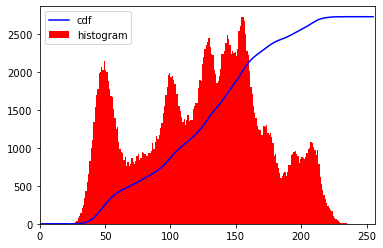

# 16bit版ヒストグラム平坦化処理


### はじめに

Opencvは画像処理についていろいろな関数がありますが、多くの関数は、8bit(256)をベースに作られています。研究用途の画像データでは、より解像度の高い16bitが用いられています。

opencvでは実装されていない16bit Grayscaleのヒストグラム平坦化処理について覚えとして記載します。

[OpenCV-Python Tutorials 1 documentation » OpenCV-Pythonチュートリアル » OpenCVを使った画像処理 » ヒストグラム その2: ヒストグラム平坦化](http://labs.eecs.tottori-u.ac.jp/sd/Member/oyamada/OpenCV/html/py_tutorials/py_imgproc/py_histograms/py_histogram_equalization/py_histogram_equalization.html#histogram-equalization)

を参考に16bit版を作成しました。

#### 環境

windows 10 Pro

Anaconda

Python 3.9

opencv 4.5


### コードと解説

画像データをopencvで読み込むとnumpyのarray形式になります。

データのタイプは通常の画像ファイルですとuint8（符号なし8ビット整数型）になります。


```python
# モジュールをインポートして、題材としてLennaさんを読み込みます。
import cv2
import numpy as np
from matplotlib import pyplot as plt

# from PIL import Image

# 画像をグレースケールで読み込む
file_name = 'Lenna_gray.png'
img = cv2.imread(file_name, cv2.IMREAD_ANYDEPTH)
# img = cv2.imread(file_name, cv2.IMREAD_GRAYSCALE | cv2.IMREAD_ANYCOLOR)

print(img.dtype)
# I = Image.open(file_name)
# img = np.array(I)

# >>> uint8
```


```python
# 16bitのデータに変換します。
img_16 = img.copy()
img_16 = img_16.astype('uint16')


# img_16 = img_16*256
print(img_16.dtype)
print(img_16.max())

# >>> uint16
# >>> 245
```


```python
### 8bit版（チュートリアルと同じ）チュートリアルを再現してみます。
def equalize_hist8(img, info=True):
    img2 = img.copy()
    hist,bins = np.histogram(img.flatten(),256,[0,256])

    cdf = hist.cumsum()
    cdf_normalized = cdf * hist.max()/ cdf.max()
    
    if info: 
        plt.imshow(img, cmap = "gray")
        plt.title('Original')
        plt.show()
        
        plt.plot(cdf_normalized, color = 'b')
        plt.hist(img.flatten(),256,[0,256], color = 'r')
        plt.xlim([0,256])
        plt.legend(('cdf','histogram'), loc = 'upper left')
        plt.show()
    

    cdf_m = np.ma.masked_equal(cdf,0)
    cdf_m = (cdf_m - cdf_m.min())*255/(cdf_m.max()-cdf_m.min())
    cdf_m2 = np.ma.filled(cdf_m,0).astype('uint8')
    img2 = cdf_m2[img]
    hist2,bins2 = np.histogram(img2.flatten(),256,[0,256])

    cdf2 = hist2.cumsum()
    cdf2_normalized = cdf2 * hist2.max()/ cdf2.max()

    
    if info: 
        plt.imshow(img2,cmap = "gray")
        plt.title('EqualizeHist')
        plt.show()
            
        plt.plot(cdf2_normalized, color = 'b')
        plt.hist(img2.flatten(),256,[0,256], color = 'r')
        plt.xlim([0,256])
        plt.legend(('cdf','histogram'), loc = 'upper left')
        plt.show()
    
    return img2

_ = equalize_hist8(img, info=True)

```





```python
### 16bit版

# - 8bitの256を16bitの65536に変更
# - 配列のデータタイプをuint16に変更
# - 少し時間がかかります。（2分ぐらい） histgramの計算に時間がかかります。

def equalize_hist16(img, info=True):
    img2 = img.copy()
    hist,bins = np.histogram(img.flatten(),65536,[0,65536])

    cdf = hist.cumsum()
    cdf_normalized = cdf * hist.max()/ cdf.max()
    
    if info: 
        plt.imshow(img,cmap = "gray")
        plt.title('Original')
        plt.show()
        
        plt.plot(cdf_normalized, color = 'b')
        plt.hist(img.flatten(),65536,[0,65536], color = 'r')
        plt.xlim([0,65536])
        plt.legend(('cdf','histogram'), loc = 'upper left')
        plt.show()
    
    cdf_m = np.ma.masked_equal(cdf,0)
    cdf_m = (cdf_m - cdf_m.min())*65535/(cdf_m.max()-cdf_m.min())
    cdf_m2 = np.ma.filled(cdf_m,0).astype('uint16')
    img2 = cdf_m2[img]
    
    hist2,bins2 = np.histogram(img2.flatten(),65536,[0,65536])
    cdf2 = hist2.cumsum()
    cdf2_normalized = cdf2 * hist2.max()/ cdf2.max()


    if info:   
        plt.imshow(img2,cmap = "gray")
        plt.title('EqualizeHist')
        plt.show()
         
        plt.plot(cdf2_normalized, color = 'b')
        plt.hist(img2.flatten(),65536,[0,65536], color = 'r')
        plt.xlim([0,65536])
        plt.legend(('cdf','histogram'), loc = 'upper left')
        plt.show()
    
    return img2 

_ = equalize_hist16(img_16, info=True)
```


```python
### 自動でDataTypeを確認して計算（8、16の両方に対応できるように変更）

def equalize_hist(img, info=True):
    img2 = img.copy()
    dataType = img.dtype
    print(dataType)
    
    if dataType == 'uint8':
        tval = 256

    elif dataType == 'uint16':
        tval = 65536
    
        
    hist,bins = np.histogram(img.flatten(),tval,[0,tval])

    cdf = hist.cumsum()
    cdf_normalized = cdf * hist.max()/ cdf.max()
    
    if info:
        plt.imshow(img,cmap = "gray")
        plt.title('Original')
        plt.show() 
        
        plt.plot(cdf_normalized, color = 'b')
        plt.hist(img.flatten(),tval,[0,tval], color = 'r')
        plt.xlim([0,tval])
        plt.legend(('cdf','histogram'), loc = 'upper left')
        plt.show()
        
    cdf_m = np.ma.masked_equal(cdf,0)
    cdf_m = (cdf_m - cdf_m.min())*(tval-1)/(cdf_m.max()-cdf_m.min())
    cdf_m2 = np.ma.filled(cdf_m,0).astype(dataType)
    img2 = cdf_m2[img]
    
    
    if info:  
        plt.imshow(img2,cmap = "gray")
        plt.title('EqualizeHist')
        plt.show()   
        
        hist2,bins2 = np.histogram(img2.flatten(),tval,[0,tval])
        cdf2 = hist2.cumsum()
        cdf2_normalized = cdf2 * hist2.max()/ cdf2.max()
        
        plt.plot(cdf2_normalized, color = 'b')
        plt.hist(img2.flatten(),tval,[0,tval], color = 'r')
        plt.xlim([0,tval])
        plt.legend(('cdf','histogram'), loc = 'upper left')
        plt.show()
        
    return img2

_ = equalize_hist(img_16, info=True)
```


### まとめ

ヒスグラムの計算で時間がかかってしまっていますが、16bitに対応するヒストグラム平坦化処理のコードを作成しました。

opencv、SciPyのndimageなどは、基本8bit対応ですので、16bitのイメージを入れるとエラーが出たり、8bitにキャストされてしまうことがあるので注意してください。